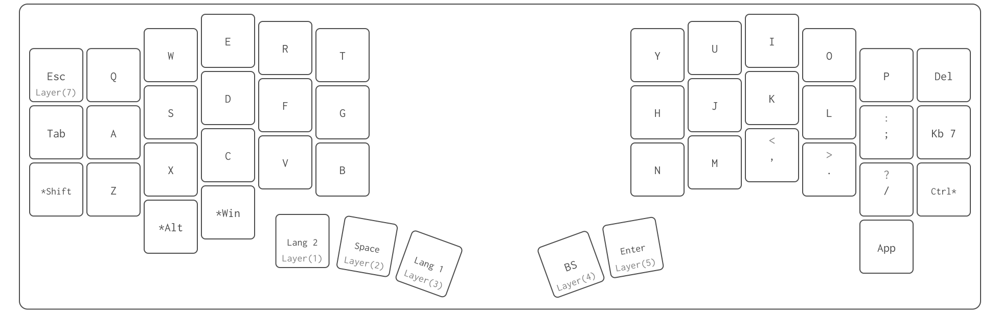
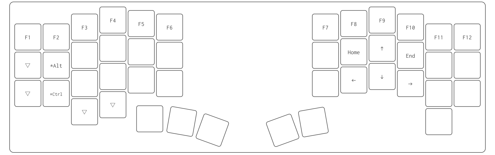
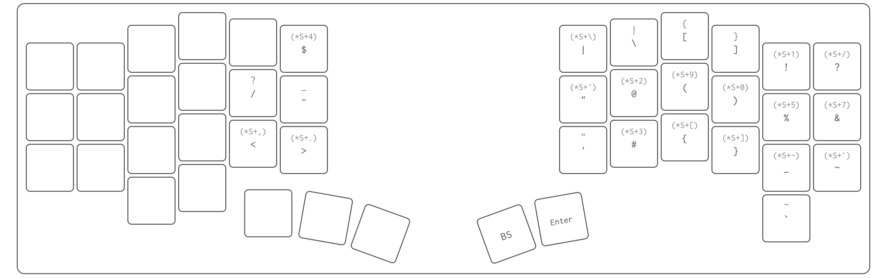
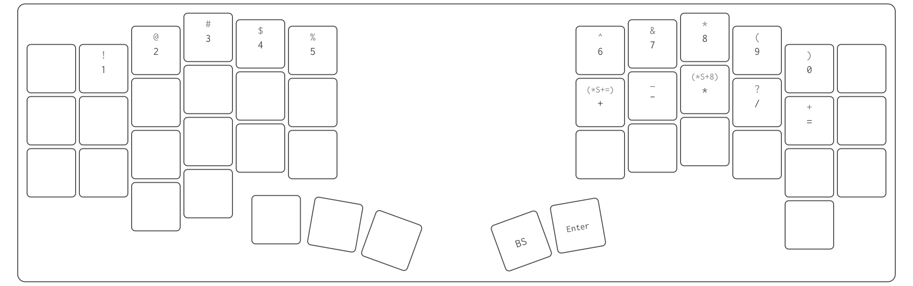
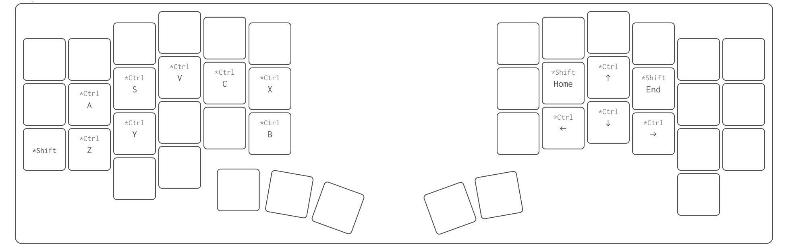
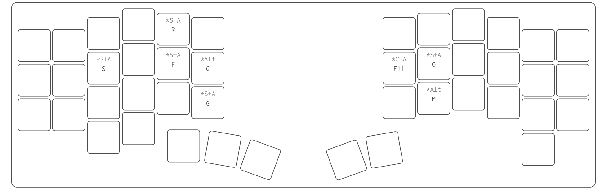
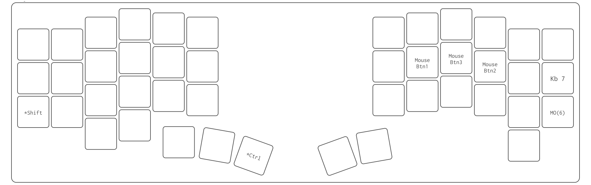
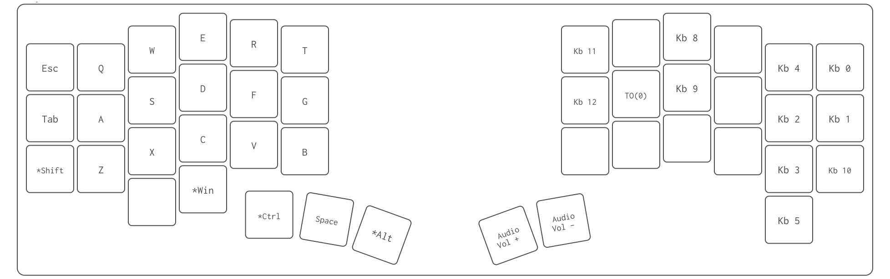

# Keyball Series

[Keyball Original Page.](https://github.com/Yowkees/keyball)

使用シリーズ Keyball44.

## ■ Keymap.

### ▼ Layer 0.

  

    
通常レイヤー、QWERTY配列

  

  

    <table>
      <tr>
        <th>キー</th> <th>情報</th>
      </tr>
      <tr>
        <td>Lang2</td>
        <td><a name"▼-layer-1.">Layer1</a> へ移動</td>
      </tr>
      <tr>
        <td>Space</td>
        <td><a name"▼-layer-2.">Layer2</a> へ移動</td>
      </tr>
      <tr>
        <td>Lang1</td>
        <td><a name"▼-layer-3.">Layer3</a> へ移動</td>
      </tr>
      <tr>
        <td>BS</td>
        <td><a name"▼-layer-4.">Layer4</a> へ移動</td>
      </tr>
      <tr>
        <td>Enter</td>
        <td><a name"▼-layer-5.">Layer5</a> へ移動</td>
      </tr>
      <tr>
        <td>Esc</td>
        <td><a name"▼-layer-7.">Layer7</a> へ移動</td>
      </tr>
    </table>
  

### ▼ Layer 1.

ファンクションキー、矢印キー用のレイヤー

### ▼ Layer 2.

Shift を押した際の特殊キー用のレイヤー

### ▼ Layer 3.

数字キー用のレイヤー

### ▼ Layer 4.

Ctrl ショートカットキー用のレイヤー  
コピー、ペースト、保存など

### ▼ Layer 5.

Visual Studio, VisualAssist, UE 用のショートカットーキーレイヤー  
※試行錯誤中...

### ▼ Layer 6.

  

    
マウス(トラックボール)操作時のレイヤー トラックボールを動かした際に自動で Layer6 に移動

  

  

    <table>
      <tr>
        <th>キー</th> <th>情報</th>
      </tr>
      <tr>
        <td>Mouse Btn1</td>
        <td>マウス左クリック</td>
      </tr>
      <tr>
        <td>Mouse Btn3</td>
        <td>マウスホイールクリック/td>
      </tr>
      <tr>
        <td>Mouse Btn2</td>
        <td>マウス右クリック</td>
      </tr>
      <tr>
        <td>Kb 7</td>
        <td>トラックボール移動でスクロール操作</td>
      </tr>
      <tr>
        <td>MO(6)</td>
        <td>Layer 6(現在のレイヤー)からデフォルトレイヤーへ移動</td>
      </tr>
    </table>
  

### ▼ Layler 7.

  

    
Keyball 設定用レイヤー

  

  

    <table>
      <tr>
        <th>キー</th> <th>情報</th>
      </tr>
      <tr>
        <td>Kb 0</td>
        <td>Keyball設定の初期化</td>
      </tr>
      <tr>
        <td>Kb 1</td>
        <td>現在のKeyball設定の保存/td>
      </tr>
      <tr>
        <td>Kb 10</td>
        <td>自動マウスレイヤー有効・無効の切り替え</td>
      </tr>
      <tr>
        <td>Kb 4</td>
        <td>CPI を1000増加</td>
      </tr>
      <tr>
        <td>Kb 2</td>
        <td>CPI を100増加</td>
      </tr>
      <tr>
        <td>Kb 3</td>
        <td>CPI を100減少</td>
      </tr>
      <tr>
        <td>Kb 5</td>
        <td>CPI を1000減少</td>
      </tr>
      <tr>
        <td>Kb 8</td>
        <td>スクロール除数を1増加</td>
      </tr>
      <tr>
        <td>Kb 9</td>
        <td>スクロール除数を1減少</td>
      </tr>
      <tr>
        <td>Kb 11</td>
        <td>自動マウスレイヤーのタイムアウトを50ms増加</td>
      </tr>
      <tr>
        <td>Kb 12</td>
        <td>自動マウスレイヤーのタイムアウトを50ms減少</td>
      </tr>
    </table>
  

## ■ Memo.

* [Remap](https://remap-keys.app/)
* [Pro Micro Web Updater](https://sekigon-gonnoc.github.io/promicro-web-updater/index.html)
* Keyball [特殊キーコード](https://github.com/Yowkees/keyball/blob/main/qmk_firmware/keyboards/keyball/lib/keyball/keycodes.md)
